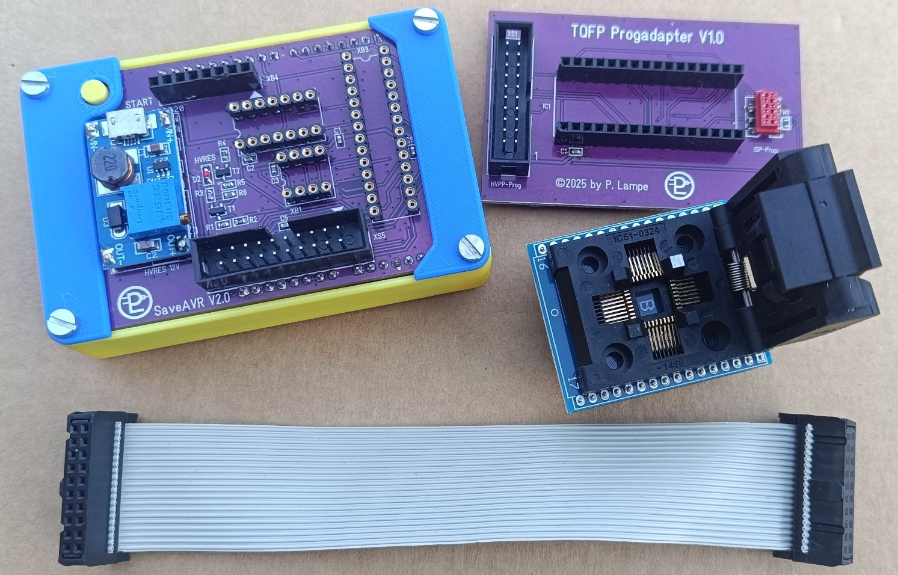
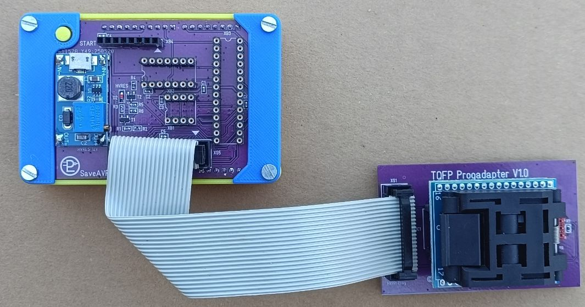

# SaveAVR

### HV-Programmiersystem für AVR-MCUs

Ich hatte immer wieder Probleme mit AVR-Controllern, beim Setzen der Fuses. Insbesondere beim Entfernen des Vorteilers oder bei der Festlegung der Taktquelle, gab es mitunter Probleme beim Schreiben. Das Resultat war ein Controller, den man über den gängigen ISP-Modus nicht mehr programmieren kann. Laut Datenblatt gibt es dafür einen Ausweg - die Hochspannungsprogrammierung. Hochspannung bedeutet hier 12V. Legt man die an RESET an, ermöglicht das eine spezielle Programmierweise, unabhängig von der aktuellen Fuses- und Lockbittkonfiguration. Je nach Controllertyp kann das parallel (HVPP) oder seriell (HVSP) erfolgen.

Bei der Recherchen bin ich auf bereits vorhandenen Lösungen gestoßen. Insbesonder die Variante, die im Artikel [RescueAVR](https://github.com/felihttps://github.com/felias-fogg/RescueAVR), beschrieben wurde, fand ich sehr gut. Hier wird ein passendes HV-Programmer-Bord beschrieben, das auf einen Arduino Uno aufgesetzt wird. Dieser enthält eine entsprechende Steuersoftware, mit der man über ein Terminalprogramm, die betroffenen MCUs wieder in deren Ursprungszustand zurückversetzen kann. Das Board funktioniert prima und ich möchte an dieser Stelle "felias-fogg" meinen Dank aussprechen.

### Systembeschreibung

Ausgehend von diesem Bord, wurde eine eigene Variante für einen HV-Programmer entwickelt. Die Controller im DIL-Gehäuse werden von mir kaum genutzt. Mir war es deshalb wichtig, dass auch Controller mit TQFP32-Gehäuse unterstützt werden. Deshalb wurde von mir die 20pol. Buchsenleiste durch einen Wannenstecker ersetzt.  TQFP-Adapter gibt es preiswert über Aliexpress. Dafür habe ich einen separaten Programmieradapter designed. Dieser ist ebenfalls mit einem Wannenstecke ausgestattet. Die Verbindung erfolgt mit einem Flachbandkabel über Pfostenbuchsen. Zusätzlich hat der Adapter noch eine 6pol. Micromatch-SMD-Buchse. Darüber ist zusätzlich auch die ISP-Programmierung möglich. 

Des Weiteren habe ich als 12V-Quelle das allseits verfügbare Booster-Modul mit dem MT3608 verwendet. Letztendlich wurde das Routing noch optimiert und alles konsequent auf SMD-Bauelemente umgestellt.

Zur besseren Handhabbarkeit wurden alle Komponenten in ein Gehäuse aus 3D-Druckteilen eingebaut. Hierbei wurde auch an eine RESET-Knopf-Verlängerung für den Arduino Uno  gedacht, um das Terminalprogramm gegebenenfalls neu zu starten. Der Zusammenbau ist recht einfach und kann den Fotos entnommen werden. Unter der TQFP-Platine werden lediglich noch 4 selbstklebende Füße angebracht. 

Die Bauunterlagen des Projekts, inklusive die Gerber-Daten für die Leiterplatten, liegen im Ordner DOKUMENTE und sind unter Beachtung der Lizenzbedingungen zur persönlichen Verwendung freigegeben. Bezüglich der Firmware für den Arduino Uno, verweise ich auf den Beitrag bei [RescueAVR](https://github.com/felihttps://github.com/felias-fogg/RescueAVR).

Bei Inbetriebnahme bitte beachten, dass die Controller nur bei abgeschalteter Betriebsspannung (USB-Stecker gezogen) eingesteckt bzw. eingelegt werden 👀️ !

### Lizenzierung

Die hier beschriebenen Hardwarekomponenten dürfen ausschließlich für private Anwendungen gebaut und verwendet werden. Ich gestatte auch die Nutzung der bereitgestellten Entwicklungsunterlagen, die ich zum Download anbiete. Eine kommerzielle Nutzung schließe ich definitiv aus! Es ist nicht gestattet, Kennzeichnungen, die auf den geistigen Ursprung der Projekte hinweisen (Copyrights, Logos, Namen,…) aus Entwicklungsunterlagen der Anlage und Anlagenteilen zu entfernen. Nachbau und Nutzung erfolgen auf eigenes Risiko. Ich hafte nicht für Schäden, die durch die Nutzung der Software, der Anlage oder Anlagenkomponenten entstehen.

